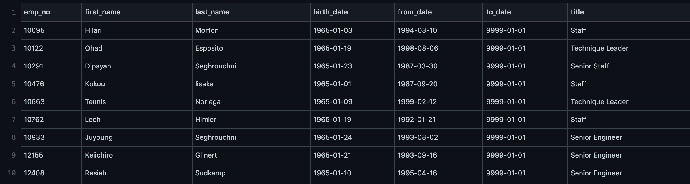
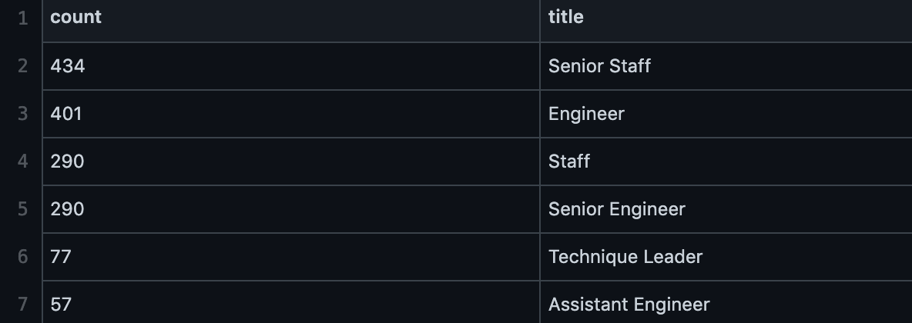
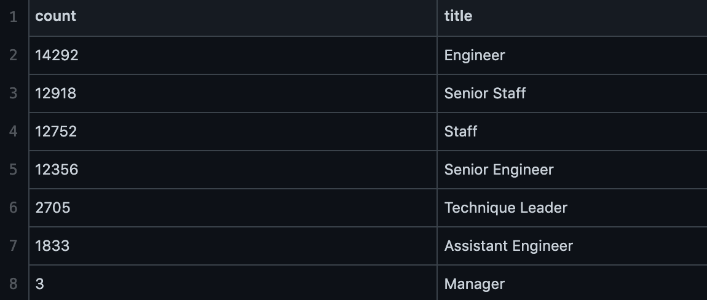

# Pewlett Hackard Analysis

# Overview
This analysis was done on behalf of Pewlett Hackard, to help them understand their workspace. Pewlett Hackard requested identification of their employees who will be retiring soon and to identify employees who can transition into a mentorship program. This analysis will help the company prepare for when there will be shift in their workspace.

# Results
### Number of Retiring Employees
This analysis was done to find the number of employees who were born between January 1, 1952 and December 31, 1955, using the most recent title for each employee. An important takeway for Pewlett Hackard is that a total of 90,396 employees who are likely to retire soon. 

Looking at the table below of the number of retirees by title, the two largest categories of retirees in the future will be for the senior team - senior engingeer and senior staff. Outside of the senior staff, for leadership there will only be two managers to retire.


###  Employees Eligible for the Mentorship Program
This analysis was done to create a mentorship-eligibility table that holds current employeee information who were born between January 1, 1965 and December 31, 1965, that can participate in a company wide mentorship program.

The number of employees that are eligible for the mentorship progam are 1,459. The analysis created for mentorship eligibility holds information about the employee such as name, birth date, date range of employment and title. The table shows an example of this analysis.



Although this analysis is helpful, a deeper breakdown into the mentorship eligibility would be helpful to Pewlett Hackard. A breakdown of how many employees per title would be great insight to see which leadership positions can transfer there knowledge. Using the following, a table was created with this information:

````
SELECT count(emp_no), title
INTO mentorship_titles
FROM mentorship_eligibilty
GROUP BY title
ORDER BY count(emp_no) DESC;
````
From this table, it can be shown that similar to the retirement titles many of the employees who are eligible for mentorship fall in the same category - senior staff. However, the second most eligible title is an engineer when compared to the retirement data is third on that list. 



# Summary
### How many roles will need to be filled as the "silver tsunami" begins to make an impact?
As the "silver tsunami" begins, a total of 90,396 potential roles will need to be filled.  

### Are there enough qualified, retirement-ready employees in the departments to mentor the next generation of Pewlett Hackard employees?
When looking at the number of potential retirees to mentorship eligibity the ratio is 90396/1456, or  1:62. This ratio means that every retiring employee there would 62 mentees, given the understanding that those retiring will provide a knowledge transfer to these mentees. Such a large ratio is not ideal for the future of the company, since the mentees maybe not be able to receive proper instructions when lost in a bigger grouo.

### Future Research

An additional query that can provide more insight is updating our mentorship eligibility table to account for current employees whose birthday is between 1962 and 1965. The updated query would look as follows:

````
SELECT DISTINCT ON (a.emp_no) [column names, not placed here for space]
FROM employees a
INNER JOIN dept_emp b on a.emp_no = b.emp_no
INNER JOIN title c on a.emp_no = c.emp_no
WHERE (a.birth_date BETWEEN '1962-01-01' AND '1965-12-31') AND (b.to_date = '9999-01-01')
ORDER BY a.emp_no ASC;
````
This query can provide us with a greater range of employees, which increase the ratio of retiring employees to mentors since the number of eligible employees mentorship increased (see table below). This updated query will also provide an opportunity of mentorship to managers which was not an option before hand.



Another way we can look into analysis is by department. We can break down the number of retiring employees and employees eligible for mentorship by department. This can be beneficial to Pewlett Hackard, because they can budget by department accordingly and continue future research by department. The next steps would be to see how many positions per department would need to be filled and how many of those seats can be mentored as well, and even more in the future we could look at the salary ranges for those employees to see how much new positions would be offered.
