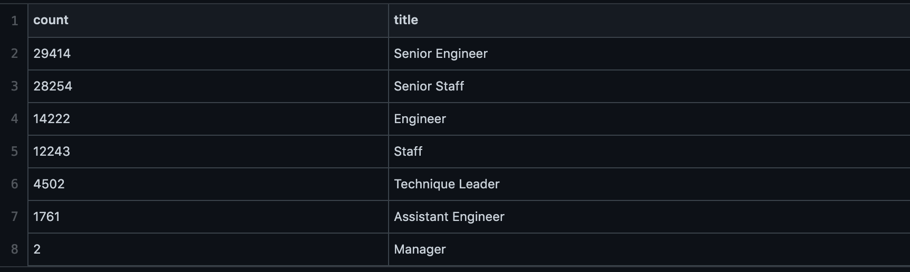

# Pewlett Hackard Analysis

# Overview
This analysis was done on behalf of Pewlett Hackard, to help them understand their workspace. Pewlett Hackard requested identification of their employees who will be retiring soon and to identify employees who can transition into a mentorship program. This analysis will help the company prepare for when there will be shift in their workspace.

# Results
### Number of Retiring Employees
This analysis was done to find the number of employees who were born between January 1, 1952 and December 31, 1955, using the most recent title for each employee. An important takeway for Pewlett Hackard is that a total of 90,396 employees who are likely to retire soon. 

Looking at the table below of the number of retirees by title, the two largest categories of retirees in the future will be for the senior team - senior engingeer and senior staff. Outside of the senior staff, for leadership there will only be two managers to retire.

###  Employees Eligible for the Mentorship Program
This analysis was done to create a mentorship-eligibility table that holds current employeee information who were born between January 1, 1965 and December 31, 1965, that can participate in a company wide mentorship program.

# Summary
1. How many roles will need to be filled as the "silver tsunami" begins to make an impact?
2. Are there enough qualified, retirement-ready employees in the departments to mentor the next generation of Pewlett Hackard employees?
